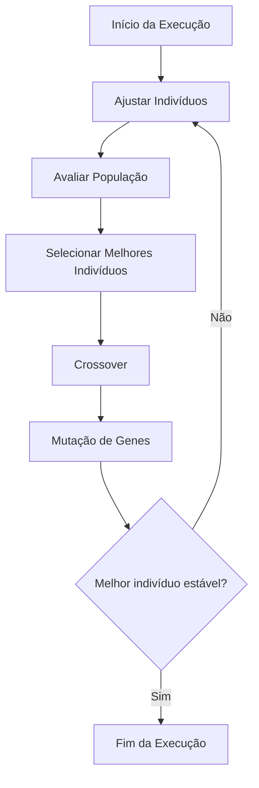
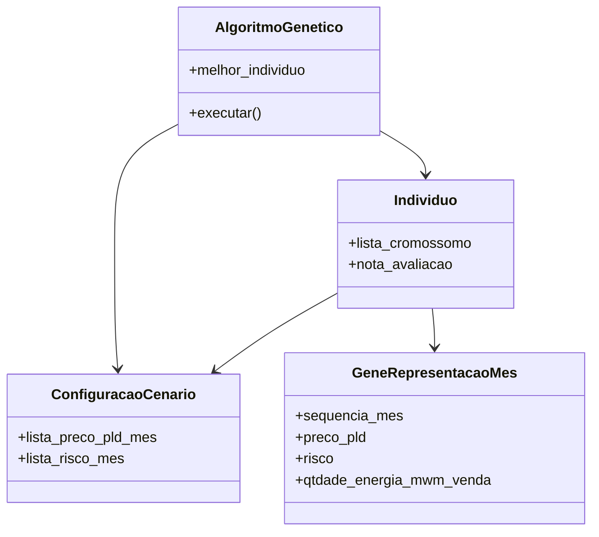

# Carteira de energia
Sistema de otimização que utiliza algoritmo genético para sugerir, de forma automatizada, uma carteira mensal de venda de energia com base em cenários de preço PLD e risco associado.

# Algoritmo genético
O algoritmo genético é uma técnica inspirada na seleção natural para resolver problemas de otimização. Na biblioteca *carteira_energia*, esse algoritmo é aplicado para maximizar o ganho financeiro anual na venda de energia, considerando metas de venda definidas pela diretoria e cenários de risco mensais.

Cada solução possível é representada por um objeto da classe `Individuo`, cujo DNA é composto por 12 genes (`GeneRepresentacaoMes`), cada um representando a quantidade de energia a ser vendida em um mês específico. O algoritmo evolui essas soluções através de operações de seleção, crossover e mutação.

## Fluxograma


## Implementação
### Diagrama de classes


### Descrição das classes
- `AlgoritmoGenetico`: Gerencia a execução do processo evolutivo.
- `ConfiguracaoCenario`: Carrega os dados do SharePoint e define o cenário de simulação.
- `Individuo`: Representa uma possível carteira mensal de energia.
- `GeneRepresentacaoMes`: Define a decisão de venda de energia em um mês específico.

### Detalhamento etapas
Cada etapa do algoritmo genético é implementada por um método na classe `AlgoritmoGenetico`. Abaixo, detalhamos o que ocorre em cada uma delas:

#### Ajustar Indivíduos
```python
self._ajustar_individuos()
```
Garante que cada `Individuo` não exceda a meta anual de venda de energia. Aplica ajustes caso ultrapasse o limite.

#### Avaliar População
```python
self._avaliar_populacao()
```
Ordena a população de indivíduos com base na função de avaliação que minimiza os riscos e desvios financeiros (`nota_avaliacao`).

#### Selecionar Melhores Indivíduos
```python
self._selecionar_melhores_individuos()
```
Armazena os melhores indivíduos da geração atual e atualiza o melhor global se for o caso.

#### Crossover
```python
self._crossover()
```
Executa a combinação de cromossomos entre pares de indivíduos para gerar novos filhos que comporão a próxima geração.

#### Mutação de Genes
```python
self._mutacao_gene()
```
Aplica mutações aleatórias nos genes dos indivíduos, respeitando a taxa de mutação definida na `ConfiguracaoCenario`.

#### Condição de Parada
```python
if self.melhor_individuo.geracao + limite_geracoes == geracao:
    break
```
Finaliza a execução quando o melhor indivíduo permanece o mesmo por um número predefinido de gerações consecutivas.
