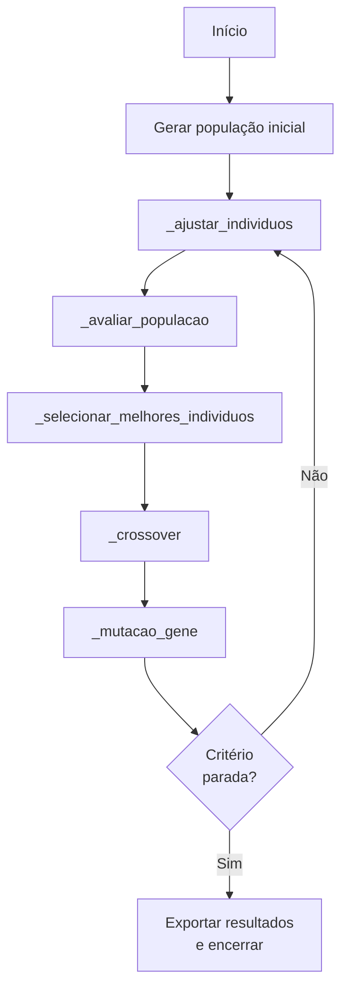
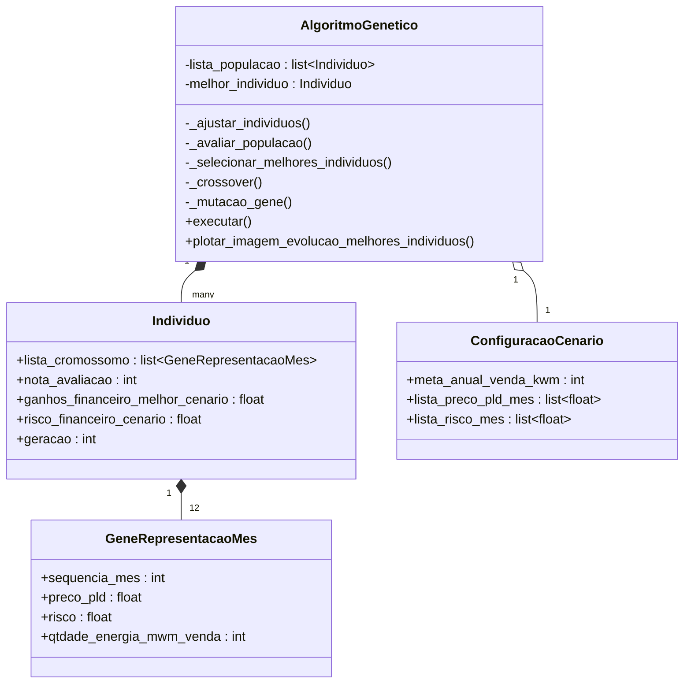

# Carteira de energia
Biblioteca Python para sugerir **carteiras de venda de energia**: lê metas anuais e cenários de preço PLD, modela riscos e ganhos mensais e aplica um Algoritmo Genético para encontrar o mix ótimo de MWh vendidos em 2023 (12 genes, um por mês).

# Algoritmo genético
O Algoritmo Genético (AG) aqui empregado segue o paradigma **evolutivo**: cada *indivíduo* representa uma solução candidata (carteira anual). O **fitness** combina dois componentes:
* **Ganhos financeiros no melhor cenário de preço** (maximizar)
* **Risco financeiro no cenário de pior preço** (minimizar)

O AG equilibra essas forças por meio de **seleção, cruzamento e mutação** até convergir para carteiras com alta nota de avaliação (0 – 100). Como fontes de dados ele consome:

* **Meta ‑ Risco A+1.xlsx** – metas corporativas de venda.
* **PLD.xlsx** – 8760 cenários de preço horário agregados em doze valores mensais.

A configuração‑padrão (2023) usa uma população de 200 indivíduos e roda até que a melhoria de fitness permaneça estável por ​_n_​ gerações consecutivas (critério de parada interno).

## Fluxograma


## Implementação
### Diagrama de classes


### Descrição das classes
* `AlgoritmoGenetico` – motor evolutivo; controla gerações, estatísticas e exportação de CSV.  
* `Individuo` – carteira anual; armazena cromossomo, nota de avaliação e métricas de risco/ganho.  
* `GeneRepresentacaoMes` – gene que descreve um único mês (preço PLD, risco, MWh vendidos).  
* `ConfiguracaoCenario` – parâmetros de entrada (metas, preços, população etc.).  

### Detalhamento etapas
Será agora detalhado, **com trechos retirados do código‑fonte**, cada etapa do algoritmo genético.

#### Ajustar Individuos
```python
def _ajustar_individuos(self):
    for individuo in self.lista_populacao:
        individuo.ajustar_venda_mes()  # respeita meta anual e limites mensais
```
Garante que todos os indivíduos obedeçam às restrições de negócio (meta anual e limites de risco por mês).

#### Avaliar População
```python
def _avaliar_populacao(self):
    self.lista_populacao.sort(reverse=True)
```
Cada `Individuo` calcula sua `nota_avaliacao` a partir de ganhos – riscos; aqui a lista é ordenada do melhor para o pior.

#### Selecionar Melhores Individuos
```python
def _selecionar_melhores_individuos(self):
    self._lista_melhores_individuos = self.lista_populacao[:self.qtdade_elite]
```
Aplica **elitismo**: uma fração `qtdade_elite` da população (tipicamente 10 %) é preservada intocada para a próxima geração.

#### Crossover
```python
def _crossover(self):
    while len(nova_populacao) < self.tamanho_populacao:
        pai, mae = choice(self._lista_melhores_individuos), choice(self.lista_populacao)
        filho = Individuo.crossover(pai, mae)
        nova_populacao.append(filho)
```
Implementa recombinação em ponto único sobre os 12 genes mensais, criando diversidade a partir dos dois genitores.

#### Mutacao Gene
```python
def _mutacao_gene(self):
    for individuo in self.lista_populacao:
        if random() < self.tx_mutacao:
            gene = choice(individuo.lista_cromossomo)
            gene.qtdade_energia_mwm_venda += choice([-1, 1]) * self.limite_variacao_mwm
```
Aplica perturbações aleatórias controladas (`tx_mutacao ≈ 2 %`) para escapar de ótimos locais.

#### Loop de Gerações
O método `executar()` integra todas as etapas anteriores dentro de um `while True` que termina quando:

```python
if self._geracoes_sem_melhora >= self.limite_estabilidade:
        break
```
(evita overfitting e reduz custo computacional).

---

*Este artigo forneceu uma visão educacional completa do uso de Algoritmos Genéticos para otimizar carteiras de venda de energia usando dados de 2023, mantendo foco estritamente no GA sem comparação com outras heurísticas.*
