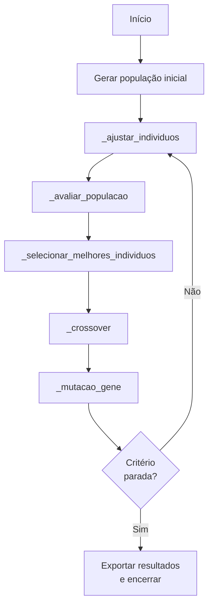
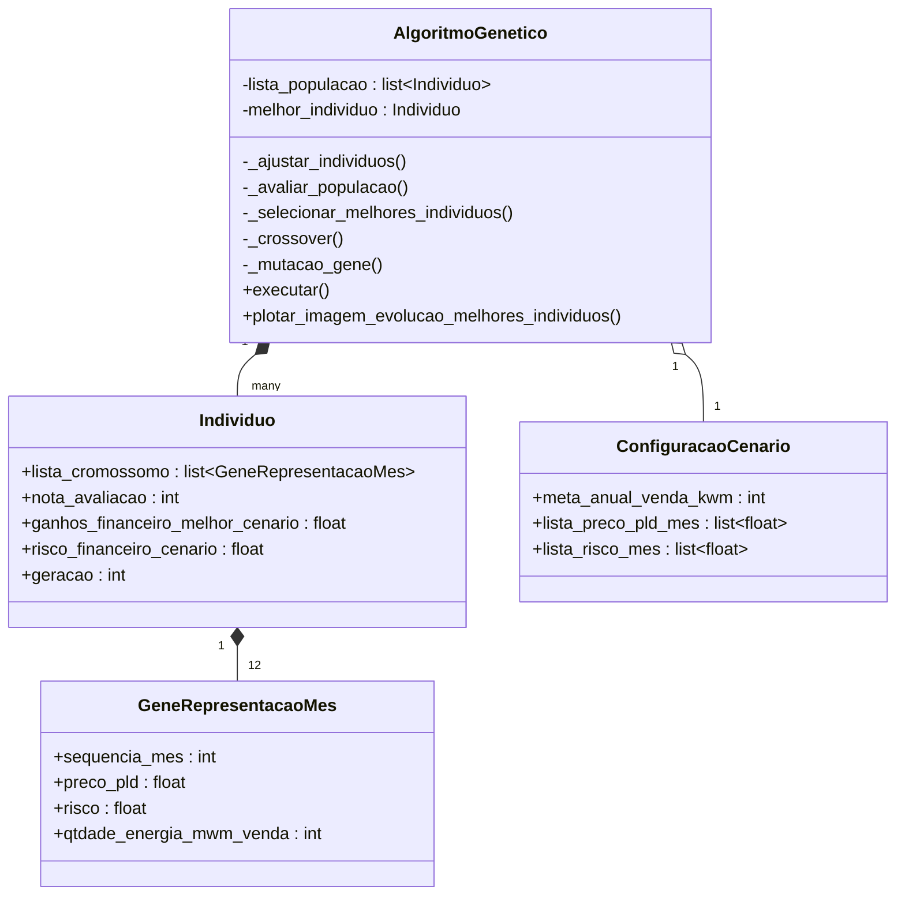
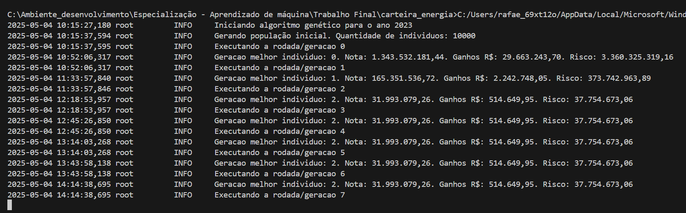
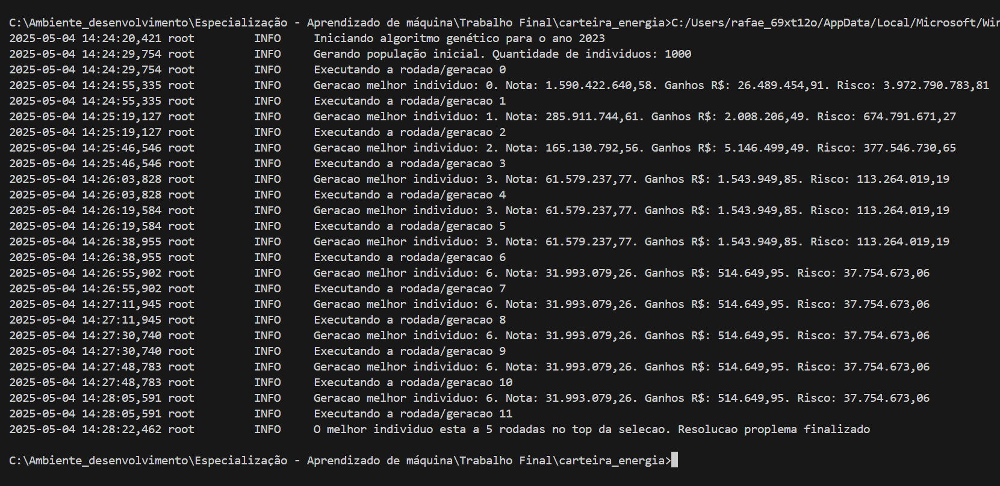

# Aluno: Rafael De Pauli Baptista

# Resumo

Este artigo apresenta a aplicação de algoritmos genéticos na resolução de problemas de otimização de carteiras de venda de energia elétrica. O trabalho descreve a estrutura e funcionamento da biblioteca `carteira_energia`, implementada em Python, que utiliza algoritmos evolutivos para maximizar ganhos financeiros e minimizar riscos operacionais. São exploradas as principais classes, como `AlgoritmoGenetico`, `Individuo` e `GeneRepresentacaoMes`, além de um fluxograma explicativo e um diagrama de classes. O artigo visa demonstrar o uso prático de técnicas evolutivas na questão de otimização da carteira de venda de energia em uma empresa de Comercialização de Energia Elétrica.

# Carteira de energia
Sistema de otimização que utiliza Algoritmo Genético (AG) para sugerir, de forma automatizada, uma carteira mensal de venda de energia com base em cenários de preço PLD e risco associado.

# Algoritmo genético
O AG aqui empregado segue o paradigma **evolutivo**: cada *indivíduo* representa uma solução candidata (carteira anual). O **fitness** combina dois componentes:
* **Ganhos financeiros no melhor cenário de preço** (maximizar)
* **Risco financeiro no cenário de pior preço** (minimizar)

O AG equilibra essas forças por meio de **seleção, cruzamento e mutação** até convergir para carteiras de acordo com a nota da avaliação. Como fontes de dados ele consome:

* **Meta ‑ Risco A+1.xlsx** – metas corporativas de venda.
* **PLD.xlsx** – 8760 cenários de preço horário agregados em doze valores mensais.

A configuração‑padrão (2023) usa uma população de 200 indivíduos e roda até que a melhoria de fitness permaneça estável por ​_n_​ gerações consecutivas (critério de parada interno).

## Função de Avaliação

A qualidade de cada indivíduo é medida por uma função de custo que pondera dois fatores principais: o desvio financeiro em relação à meta de ganhos (DSVA) e o risco financeiro ponderado da operação (RPPDA). A fórmula é definida como:

$$
\text{nota\_avaliacao} =
\begin{cases}
w_1 \cdot \text{DSVA} + (1 - w_1) \cdot \text{RPPDA}, & \text{se não excedeu limite de energia} \\\\
\text{nota\_máxima}, & \text{caso contrário}
\end{cases}
$$

Onde:
- *w_1* é o peso da penalização por desvio (ex.: 0.6),
- DSVA é o desvio entre o ganho real e a meta anual definida,
- RPPDA representa o risco financeiro da operação,
- *nota_máxima* é usada como penalidade para soluções inválidas.

Essa função visa minimizar simultaneamente o desvio da meta e o risco de mercado, equilibrando ambos conforme os pesos definidos no cenário de simulação.
A seleção dos indivíduos se através da menor nota de avaliação.

## Fluxograma

O diagrama abaixo ilustra o fluxo de execução do AG.



## Implementação
### Diagrama de classes


### Descrição das classes
* `AlgoritmoGenetico` – motor evolutivo; controla gerações, estatísticas e exportação de CSV.  
* `Individuo` – carteira anual; armazena cromossomo, nota de avaliação e métricas de risco/ganho.  
* `GeneRepresentacaoMes` – gene que descreve um único mês (preço PLD, risco, MWh vendidos).  
* `ConfiguracaoCenario` – parâmetros de entrada (metas, preços, população etc.).  

### Detalhamento etapas
Cada etapa do algoritmo genético é implementada por um método na classe `AlgoritmoGenetico`. Abaixo, detalhamos o que ocorre em cada uma delas:

#### Ajustar Indivíduos
```python
self._ajustar_individuos()
```
Garante que cada `Individuo` não exceda a meta anual de venda de energia. Aplica ajustes caso ultrapasse o limite.

#### Avaliar População
```python
self._avaliar_populacao()
```
Ordena a população de indivíduos com base na função de avaliação que minimiza os riscos e desvios financeiros (`nota_avaliacao`).

#### Selecionar Melhores Indivíduos
```python
self._selecionar_melhores_individuos()
```
Armazena os melhores indivíduos da geração atual e atualiza o melhor global se for o caso.

#### Crossover
```python
def _crossover(self):
        qtdade_meses_ano = 12
        lista_individuo_nova_geracao = []

        for indice in range(round(self.configuracao_cenario.tamanho_populacao / 2)):
            pai, mae = self._selecao_pais()

            area_corte_cromosso_individuo = round(random() * qtdade_meses_ano)

            filho1 = Individuo(configuracao_cenario=self.configuracao_cenario, gerar_cromossomo=False, geracao=pai.geracao+1)
            filho2 = Individuo(configuracao_cenario=self.configuracao_cenario, gerar_cromossomo=False, geracao=pai.geracao+1)

            filho1.lista_cromossomo = copy.deepcopy(pai.lista_cromossomo[0:area_corte_cromosso_individuo] + mae.lista_cromossomo[area_corte_cromosso_individuo::])
            filho2.lista_cromossomo = copy.deepcopy(pai.lista_cromossomo[0:area_corte_cromosso_individuo] + mae.lista_cromossomo[area_corte_cromosso_individuo::])

            lista_individuo_nova_geracao.append(filho1)
            lista_individuo_nova_geracao.append(filho2)
        
        self.lista_populacao = lista_individuo_nova_geracao
        self._avaliar_populacao()
```
Executa a combinação de cromossomos entre pares de indivíduos para gerar novos filhos que comporão a próxima geração.

Realiza o cruzamento entre pares de indivíduos selecionados por roleta, trocando partes dos seus cromossomos (genes mensais) para gerar nova população com características combinadas dos pais.

#### Mutação de Genes
```python
for individuo in self.lista_populacao:
            if random() < self.configuracao_cenario.taxa_mutacao:
                posicao_gene_mutacao = round(random() * (len(individuo.lista_cromossomo) - 1))

                gene_mutacao = individuo.lista_cromossomo[posicao_gene_mutacao]
                valor_mutacao = round(gene_mutacao.qtdade_energia_mwm_venda * random())

                valor_antigo_gene = gene_mutacao.qtdade_energia_mwm_venda

                operacao_matematica_randomica = choice((add, sub))
                gene_mutacao.qtdade_energia_mwm_venda = operacao_matematica_randomica(gene_mutacao.qtdade_energia_mwm_venda, valor_mutacao)

```
Aplica mutações aleatórias nos genes dos indivíduos, respeitando a taxa de mutação definida (15%) na classe `ConfiguracaoCenario`.

Percorre cada indivíduo da população e, com base na taxa_mutacao, altera aleatoriamente a quantidade de energia de um gene, somando ou subtraindo um valor proporcional, simulando variação genética.

#### Condição de Parada
```python
if self.melhor_individuo.geracao + limite_geracoes == geracao:
    break
```
Finaliza a execução quando o melhor indivíduo permanece o mesmo por um número predefinido de gerações consecutivas.


# Resumo

## Execução biblioteca

Executar script `carteira_energia/executar.py`

## Resultados

- Segue resultado de AG com uma população de 10.000 indivíduos:


- Segue resultado de AG com uma população de 1.000 indivíduos:


Ambos cenários chegaram ao mesmo resulatdo ótimo.

## Algoritmo Genético

A classe `AlgoritmoGenetico` localizado no script `carteira_energia/algoritmo_genetico.py` implementa toda a lógica do AG